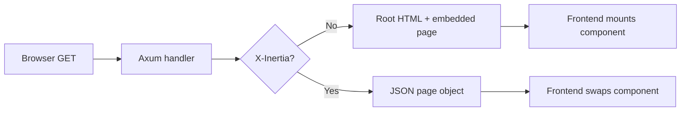

Inertia keeps routing and data loading in Axum while Svelte, React, or Vue renders the page. It does not require a separate client router or JSON API.



## HTML first, JSON later

The first browser request has no `X-Inertia` header, so the adapter returns a complete root document with assets and an embedded page object. Inertia links and router visits send `X-Inertia: true`; the same handler then returns the page object as JSON.

The page object identifies the frontend `component`, its `props`, the displayed `url`, and an optional asset `version`. Deferred, merge, scroll, once, and shared metadata are catalogued in [Protocol behavior](/docs/advanced/protocol-behavior).

## Axum still owns every route

```rust title="src/router.rs"
use axum::{Router, routing::get};
use inertia_axum::prelude::*;

async fn home() -> DynamicPage {
    page!("Home", { message: "Rendered through Inertia" })
}

pub fn router(inertia: InertiaApp) -> Router {
    Router::new()
        .route("/", get(home))
        .route("/health", get(|| async { "ok" }))
        .inertia(inertia)
}
```

Normal health, download, JSON, and WebSocket routes remain ordinary Axum responses. With SSR configured, eligible initial visits may include rendered component HTML; Inertia visits still return JSON.
